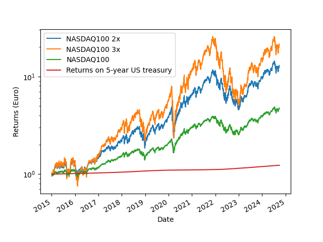
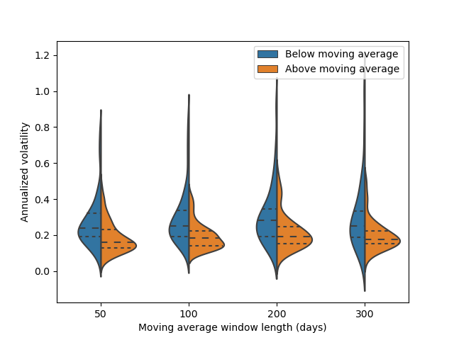
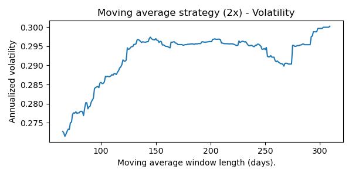
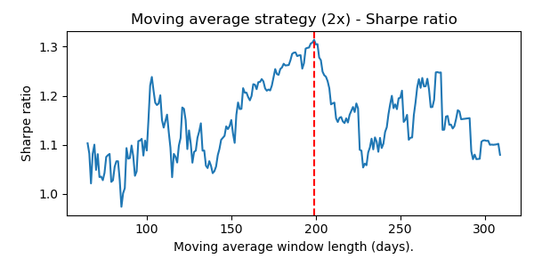
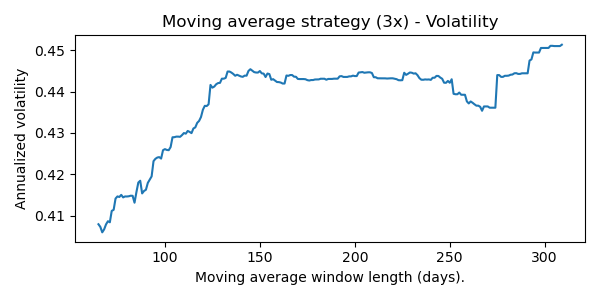
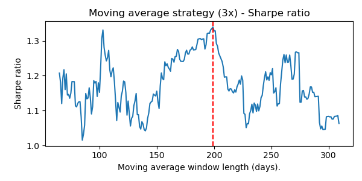
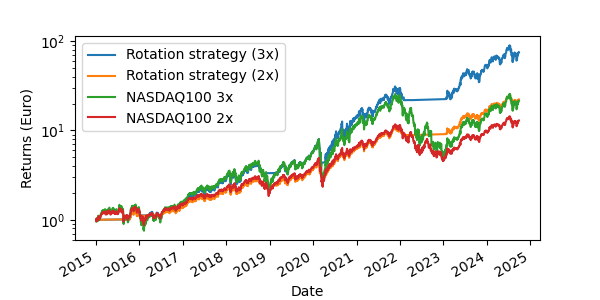
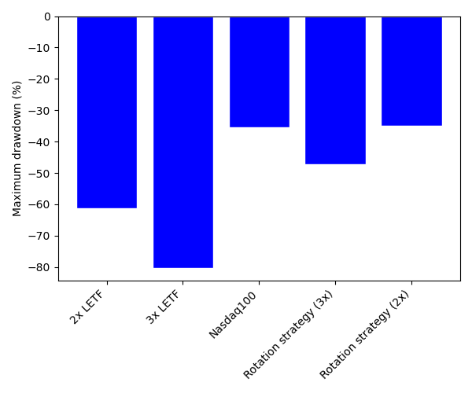
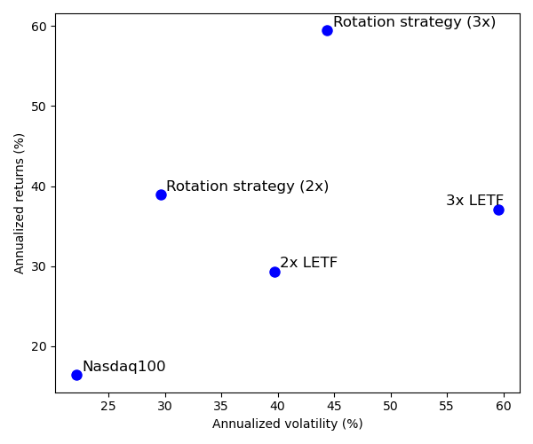

## Introduction
Leverage is a powerful tool that can significantly amplify the performance of a portfolio, but it also comes with the trade-off of increased risk. In this brief study, we focus on a daily-rebalanced Leveraged Exchange-Traded Fund (LETF). Due to daily re-leveraging, LETFs tend to be negatively impacted by periods of high volatility, a phenomenon known as volatility decay (see, e.g., Ref. 1). Conversely, LETFs can benefit from extended periods of low volatility and positive returns. The purpose of this study is to explore a potential strategy for identifying periods of low volatility, during which LETFs may outperform their underlying index.

### Disclaimer
The content provided here is for educational purposes only. It is not intended as financial advice or as a recommendation for any particular investment strategy.

## Methods
The strategy analyzed in this study involves rotating between a LETF and short-term bonds based on whether the LETF's underlying index is above or below its moving average. We consider various moving average periods to evaluate their impact. The index under consideration is the NASDAQ 100, and we analyze two LETFs: a 2x leveraged ETF (*Amundi Nasdaq-100 2x Daily Leveraged*, ticker: LQQ.PA) and a 3x leveraged ETF (*WisdomTree NASDAQ 100 3x Daily Leveraged*, ticker: QQQ3.MI).

Please note that the y-label of the figure above is expressed in logarithmic scale.

## Analysis of the volatility
We first analyze the volatility of the NASDAQ 100 index from January 1, 1990, to October 1, 2024. Using a moving average window of length T, we evaluate the volatility of the index during periods when it is either above or below its moving average.

The results of a Mann-Whitney U Test are provided in the code below. As shown in the figure, the index exhibits **significantly lower volatility when it is above its rolling average compared to when it is below**.

## Analysis of the strategy
The main parameter of the strategy is the length of the moving average window. A short window (e.g., 70 days) is more responsive to recent market changes, allowing for quicker adjustments but at the cost of more frequent trading and potential whipsawing. In contrast, a long window (e.g., 300 days) results in fewer trades and is less reactive to short-term market fluctuations, potentially providing more stability but being slower to adapt to new trends.

    

As shown in the analysis, both for the 2x and 3x LETF, the maximum Sharpe ratio is achieved with a moving average window of 199 days. This offers the best balance of responsiveness and stability in backtesting. According to this analysis, applying the rotating strategy to the 3x LETF would have been the optimal strategy in the past years. However, it is important to note that there is no guarantee this optimal condition will remain the same in the future.

## References
1. Gayed, Michael, Leverage for the Long Run - A Systematic Approach to Managing Risk and Magnifying Returns in Stocks (March 3, 2016). 2016 Charles H. Dow Award Updated Through December 31, 2020, Available at SSRN: https://ssrn.com/abstract=2741701 or http://dx.doi.org/10.2139/ssrn.2741701